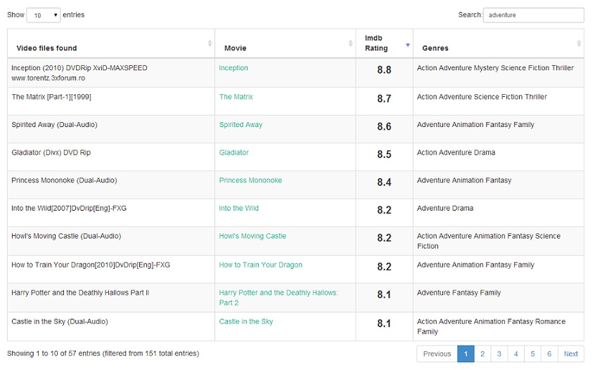

MoviesInfo (webapp)
==========

Get instant information (imdb link, rating, genre and trailer) for your local movies collection.

Motivation
==========
I recently started my movie collection and as it was growing I got confused for what movies to watch.
It was tedius to copy paste every single movie on google, so I created this web app. 
(And it's my first open source project project.)

Overview
==========
The main idea was to put everything in frontend, for quick results.
Google webkitdirectory is used for selecting folder.
TMDB, Imdb and youtube api are used for getting genre,rating and trailer respectively.

TODO
==========
1. recommandation
2. sharing movies list (maybe)
3. waiting for more suggestions
